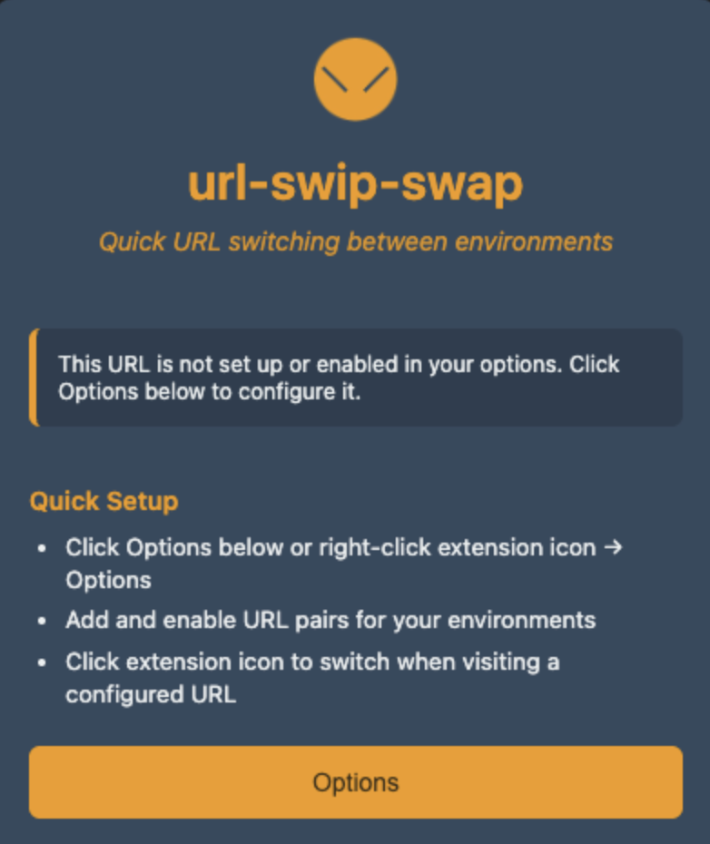

# url-swip-swap Chrome extension

This is a super simple Chrome extension that converts the current tab's URL from one environment to another while preserving the full URL.

    
    

## Behavior
- While on a website configured in the options:
  - Clicking the extension will convert the URL to its TEST environment equivalent if it matches the configured TEST URL.
  - Clicking the extension will convert the URL to its DEV environment equivalent if it matches the configured DEV URL.
- While on an unsupported domain:
  - An alert will trigger, indicating that the domain is not supported.

## Usage
- Right click the extension
- Select "Options"
- Enter the URLs you want to swap
- Click the checkbox to enable

## Installation
1. Clone this repo locally
2. Update the TEST and DEV variables
3. Navigate to [chrome://extensions/](chrome://extensions/)
4. Ensure that "Developer mode" is toggled on (in the upper right)
5. Click "Load unpacked" in the upper left
6. Select this entire url-swip-swap dir
7. Pin the extension and its ready to use!
