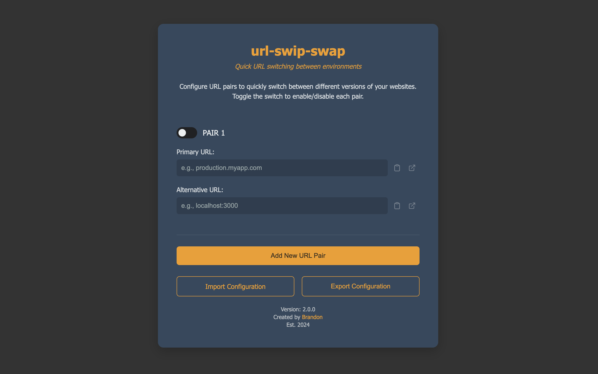

# url-swip-swap Chrome extension

A super simple Chrome extension that allows for effortlessly switching between different URLs while preserving parameters with just a click, perfect for transitioning between testing and development environments or any two specified URLs.

    
    

## Behavior
- While on a website configured in the options:
  - Clicking the extension will convert the URL to its TEST environment equivalent if it matches the configured TEST URL.
  - Clicking the extension will convert the URL to its DEV environment equivalent if it matches the configured DEV URL.
- While on an unsupported domain:
  - Messaging will be shown indicating that the domain is not supported.
- While using a mis-configured url:
  - Messaging will be shown indicating the error thrown by chrome.

## Usage
- Click Options
  - Right click the extension.
  - Select "Options".
- Enter the URLs you want to swap.
- Click the checkbox to enable each set.
- Settings are auto-saved.

## Installation
1. Clone this repo locally.
2. Update the TEST and DEV variables.
3. Navigate to [chrome://extensions/](chrome://extensions/).
4. Ensure that "Developer mode" is toggled on (in the upper right).
5. Click "Load unpacked" in the upper left.
6. Select this entire url-swip-swap dir.
7. Pin the extension and its ready to use!

## GOTCHYA
- This must use https when running localhost
- `HTTPS=true npm start`
